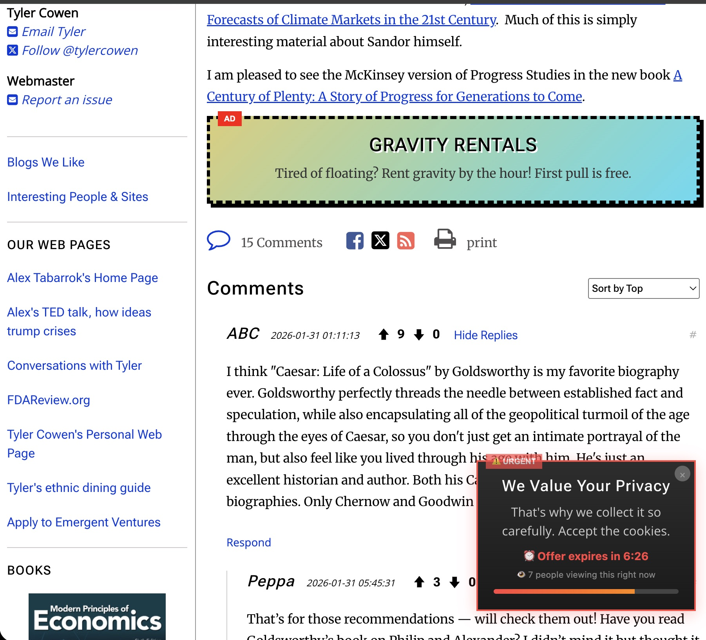

# AdBoost

AdBoost is the only browser extension that adds ads to web pages!

## Install

1. Clone this repo
2. Open `chrome://extensions`
3. Enable "Developer mode"
4. Click "Load unpacked" and select this folder
